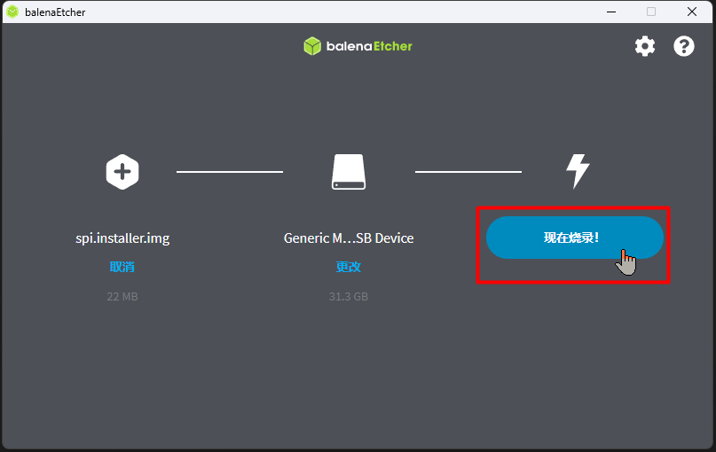
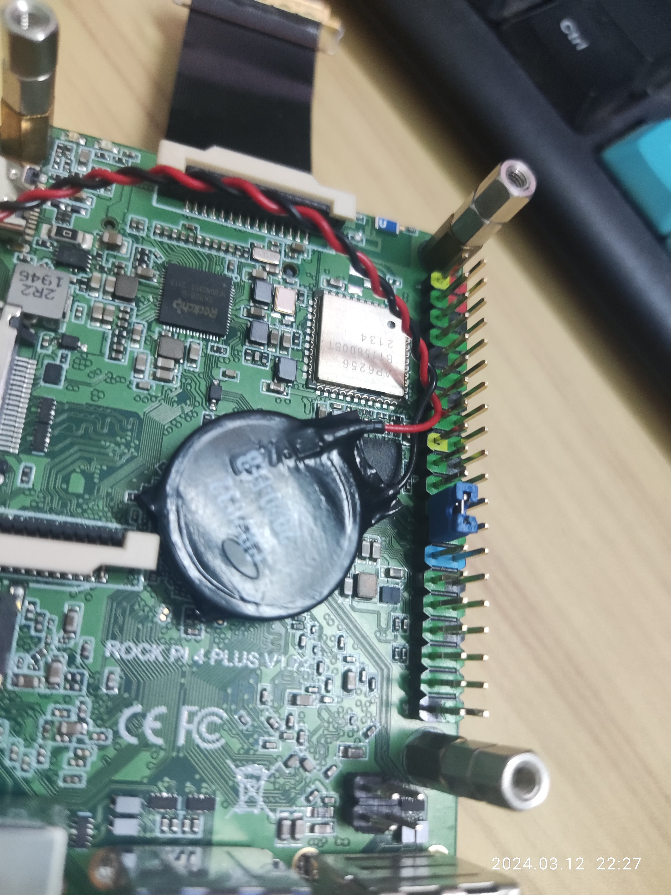
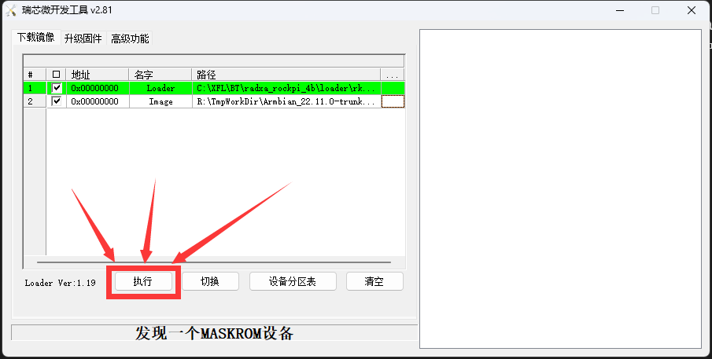

@[TOC](Radxa Rockpi 4B 刷机Armbian指南)

# 前言

本文有很强的 ~~思想灌输~~ 个人习惯倾向，若不能接受，可以**立刻关闭**。  

# 设备准备

## 瑞莎科技 Radxa Rockpi 4B （配图是 4B+ 带 SPI NOR FLASH 的版本）


## USB转TTL小板


## 一张至少 16GB 的 MicroSD(TF) 卡和 MicroSD卡USB读卡器


## 双公头USB 2.0 (Type-A) 数据线


## 2.54mm杜邦线至少3条、（可选）短路帽跳线帽若干、（可选）排针若干


# 数字资源准备

## 所有资源整合，一次性下载完（推荐）

磁力链接：`magnet:?xt=urn:btmh:122034ee898984e6d5147b7e8b1880bb6ebe8d8abb99df201bd58d9e384af30a2955&dn=radxa_rockpi_4b&tr=https%3A%2F%2Ft1.hloli.org%2Fannounce&tr=http%3A%2F%2Ftracker.opentrackr.org%3A1337%2Fannounce&tr=wss%3A%2F%2Ftracker.openwebtorrent.com%3A443%2Fannounce&tr=https%3A%2F%2Fopentracker.i2p.rocks%2Fannounce`  

### 磁力链接提示格式错误

- 没错，我贴的磁力链接是 BTv2 格式的  
- 比特彗星BitComet 2.x 版本都是支持 BTv2 格式的磁力链接的。已知xun雷不支持 BTv2 。  
- qBittorrent 要 `4.6.3 (lt20 qt6)` 版的才能支持 BTv2 。如果你用的是 Linux 无图形界面的 qBittorrent-nox 则默认支持 BTv2 。  
    
- qBittorrent 官方发布地址：[https://www.qbittorrent.org/download](https://www.qbittorrent.org/download)  

SHA256 校验值对照
|SHA256校验值|相对路径|
|:-|:-|
|5c4e8febbfba97524fb87dc179c497ced85a80c802ebbf1bece385aaaca4aac8|radxa_rockpi_4b/loader/rk3399_loader_spinor_v1.15.114.bin|
|d38ed3ffb2a34626a2effdcf5c62ad8b986e14aa4b209ceabbb24494f05d9fa4|radxa_rockpi_4b/loader/rk3399_loader_v1.20.119.bin|
|f2a7ba944edaa77821984bcc510e35c4c758b56b7f75ddf0dba3f9ebfbaf1f5a|radxa_rockpi_4b/loader/rk3399_loader_v1.27.126.bin|
|3ee83bb30871479392265d1b89757bf701ff85c47e8ca7726838fea51c2ffd3a|radxa_rockpi_4b/system/Armbian_22.11.0-trunk_Rockpi-4b_bullseye_current_5.15.76_minimal.img.xz|
|51be9ce7cf051ddd4811e60cee47844b26fdeab7c7aae00ede2b1fb632d38e91|radxa_rockpi_4b/system/Armbian_24.2.4_Uefi-arm64_jammy_current_6.6.21_kde-neon_desktop.img.xz|
|e1a6794bf5041194ff6d1c1821f428d7f51386ba712b4f9becb3f61bd78dd5d3|radxa_rockpi_4b/tool/balenaEtcher-Portable-1.18.11.exe|
|30044d0a6a15f922963d13b8409120abef16783e456c73bceb8148bc30f806c3|radxa_rockpi_4b/tool/DriverAssitant_v5.0.zip|
|a0819ad260f102d025a81bd690b6fa8372e8e5d646c005eba178774db980639b|radxa_rockpi_4b/tool/RKDevTool_Release_v2.81.zip|
|01b2d51a5c08831afac7970008eeff95d2bd8725731a8306dc978031a557cfe7|radxa_rockpi_4b/tool/tabby-1.0.207-portable-x64.zip|
|7c3ea05a7a9d90c57468e9707eea9c951d8eca7ca97c4a89416b6cc82a6a3488|radxa_rockpi_4b/uboot/Tow-Boot/radxa-RockPi4-2021.10-005.tar.xz|
|6361641a639c0edc39c8b34c6180b3fe4b3965b9855907fe1fef0de1a764c847|radxa_rockpi_4b/uboot/Tow-Boot/radxa-RockPi4-2022.07-006.tar.xz|

## 不相信作者制作的资源，可以自己一个一个下载

### RKDevTool_Release_v2.81.zip

- 说明：RKDevTool（瑞芯微开发工具。Rockchip平台底层刷板工具）  
- radxa 官方：[https://dl.radxa.com/tools/windows/](https://dl.radxa.com/tools/windows/)  
- HTTP 链接：[https://dl.radxa.com/tools/windows/RKDevTool_Release_v2.81.zip](https://dl.radxa.com/tools/windows/RKDevTool_Release_v2.81.zip)  

### DriverAssitant_v5.0.zip

- 说明：RKDriverAssistant（Rockchip平台设备驱动。不装，电脑不识别板子）  
- radxa 官方：[https://dl.radxa.com/tools/windows/](https://dl.radxa.com/tools/windows/)  
- HTTP 链接：[https://dl.radxa.com/tools/windows/DriverAssitant_v5.0.zip](https://dl.radxa.com/tools/windows/DriverAssitant_v5.0.zip)  

### RK3399 loader

- 说明：板子的maskrom模式需要临时加载它到内存里才能执行高级操作
- radxa 官方：[https://dl.radxa.com/rockpi/images/loader/](https://dl.radxa.com/rockpi/images/loader/)  
- 文件名：`rk3399_loader_v1.20.119.bin`  
  - HTTP 链接：[https://dl.radxa.com/rockpi/images/loader/rk3399_loader_v1.20.119.bin](https://dl.radxa.com/rockpi/images/loader/rk3399_loader_v1.20.119.bin)  
- 文件名：`rk3399_loader_v1.27.126.bin`  
  - HTTP 链接：[https://dl.radxa.com/rockpi/images/loader/rk3399_loader_v1.27.126.bin](https://dl.radxa.com/rockpi/images/loader/rk3399_loader_v1.27.126.bin)  
- 文件名：`rk3399_loader_spinor_v1.15.114.bin`  
  - HTTP 链接：[https://dl.radxa.com/rockpi/images/loader/spi/rk3399_loader_spinor_v1.15.114.bin](https://dl.radxa.com/rockpi/images/loader/spi/rk3399_loader_spinor_v1.15.114.bin)

### balenaEtcher-Portable-1.18.11.exe

- 说明：开源的Windows平台烧录镜像的小工具  
- 官方发布地址：[https://github.com/balena-io/etcher/releases](https://github.com/balena-io/etcher/releases)  
- HTTP 链接：[https://github.com/balena-io/etcher/releases/download/v1.18.11/balenaEtcher-Portable-1.18.11.exe](https://github.com/balena-io/etcher/releases/download/v1.18.11/balenaEtcher-Portable-1.18.11.exe)  

### tabby-1.0.207-portable-x64.zip

- 说明：开源且强大的Shell终端，支持Telnet、SSH和串口终端等  
- 官方发布地址：[https://github.com/Eugeny/tabby/releases](https://github.com/Eugeny/tabby/releases)  
- HTTP 链接：[https://github.com/Eugeny/tabby/releases/download/v1.0.207/tabby-1.0.207-portable-x64.zip](https://github.com/Eugeny/tabby/releases/download/v1.0.207/tabby-1.0.207-portable-x64.zip)  

### radxa-RockPi4-2022.07-006.tar.xz

- 说明：Tow-Boot 开源且强大的第三方Uboot  
- 官方发布地址：[https://github.com/Tow-Boot/Tow-Boot/releases](https://github.com/Tow-Boot/Tow-Boot/releases)  
- HTTP 链接：[https://github.com/Tow-Boot/Tow-Boot/releases/download/release-2022.07-006/radxa-RockPi4-2022.07-006.tar.xz](https://github.com/Tow-Boot/Tow-Boot/releases/download/release-2022.07-006/radxa-RockPi4-2022.07-006.tar.xz)  

### Armbian_22.11.0-trunk_Rockpi-4b_bullseye_current_5.15.76_minimal.img.xz

- 说明：Radxa 官方编译的 Armbian 系统。我们需要拿它来解除 Radxa 官方 Uboot 的限制以及重置 emmc 。（4A/4B型号的用户不需要这个文件）  
- 官方发布地址：[https://github.com/radxa-build/rock-pi-4b/releases](https://github.com/radxa-build/rock-pi-4b/releases)  
- HTTP 链接：[https://github.com/radxa-build/rock-pi-4b/releases/download/20221101-0235/Armbian_22.11.0-trunk_Rockpi-4b_bullseye_current_5.15.76_minimal.img.xz](https://github.com/radxa-build/rock-pi-4b/releases/download/20221101-0235/Armbian_22.11.0-trunk_Rockpi-4b_bullseye_current_5.15.76_minimal.img.xz)  

### Armbian UEFI 版

- 说明：我们最终要安装的系统。自己任选一种。本篇使用基于 Ubuntu 的 桌面版。  
- Armbian UEFI 版官方发布地址：[https://www.armbian.com/uefi-arm64/](https://www.armbian.com/uefi-arm64/)  
- 桌面版  
  - 文件名：`Armbian_24.2.1_Uefi-arm64_bookworm_current_6.6.16_gnome_desktop.img.xz`  
    - 官方 HTTP 直链下载地址：[https://dl.armbian.com/uefi-arm64/archive/Armbian_24.2.1_Uefi-arm64_bookworm_current_6.6.16_gnome_desktop.img.xz](https://dl.armbian.com/uefi-arm64/archive/Armbian_24.2.1_Uefi-arm64_bookworm_current_6.6.16_gnome_desktop.img.xz)  
    - 官方种子磁力链接：`magnet:?xt=urn:btih:VKHYT3XUW6FTWP7H2HEVJ76TDQBQOLLD`  
  - 文件名：`Armbian_24.2.4_Uefi-arm64_jammy_current_6.6.21_kde-neon_desktop.img.xz`  
    - 官方 HTTP 直链下载地址：[https://dl.armbian.com/uefi-arm64/archive/Armbian_24.2.4_Uefi-arm64_jammy_current_6.6.21_kde-neon_desktop.img.xz](https://dl.armbian.com/uefi-arm64/archive/Armbian_24.2.4_Uefi-arm64_jammy_current_6.6.21_kde-neon_desktop.img.xz)  
    - 官方种子磁力链接：`magnet:?xt=urn:btih:WNKTAJZ2HRN4KQK77RJBNW57J5FF7TK4`  
- CLI版  
  - 文件名：`Armbian_24.2.1_Uefi-arm64_bookworm_current_6.6.16.img.xz`  
    - 官方 HTTP 直链下载地址：[https://dl.armbian.com/uefi-arm64/archive/Armbian_24.2.1_Uefi-arm64_bookworm_current_6.6.16.img.xz](https://dl.armbian.com/uefi-arm64/archive/Armbian_24.2.1_Uefi-arm64_bookworm_current_6.6.16.img.xz)  
    - 官方种子磁力链接：`magnet:?xt=urn:btih:V4SI3S5EOCPQ764BKDNPBOGK3NP7F23F`  

# 回答一下一些疑问

## 为什么主角开发板正面照不拆散热片？

- 因为拆了难装回去，要重新贴散热片，就没拆了。（逃  

## 为什么楼主用的是 `4B+` 版的？`4B` 和 `4B+` 有什么区别？

- 官网硬件差异 [Rockpi4/hardware/revision - Radxa Wiki](https://wiki.radxa.com/Rockpi4/hardware/revision)  
  官网型号对比 [Rockpi4/hardware/models - Radxa Wiki](https://wiki.radxa.com/Rockpi4/hardware/models)  
- 因为官方频繁改动硬件参数。早期的 4B+ 板子有 4MB SPI NOR FLASH ，而后期的没有。因为 4B+ 在主板上加焊了 mashroom 按钮，可以直接屏蔽板载 emmc 模块，也蛮好使的，`4B+` 除了CPU性能超频以外和 `4B` 基本没有区别，所有适配 `4B` 型号的系统，`4B+` 都能刷，是兼容的，所以我原本也想推荐一波。**但是因为官方这个薛定谔的 SPI NOR FLASH 问题，所以还是建议购买 4A/4B 版本，最起码保证有 4MB 的 SPI NOR FLASH ！！！** 请务必检查确认自己的 Rockpi 4 开发板是否有板载 SPI NOR FLASH 。如果没有，请自己焊一个上去，本教程依赖这个 FLASH ， **没有这个 FLASH 你将无法直接抄作业！！！**  

## USB转TTL小板选购问题

- 作者使用的是 `广州优硕CH340G`。因为看起来品质很有保证的样子，而且 **作者不是电子工程师** ……就是这样。。  
- 大家可以选购其他芯片的，例如 `CH343` 。反正最终能在电脑端握手 TTL 串口就行。  

## 为什么 MicroSD 卡容量要 16GB 起步？

- 因为 Armbian 桌面版的系统镜像就有 9GiB 左右  
- 如果不装图形界面的版本，可以用 8GB 起步的 MicroSD 卡  

## 作者的“双公头USB-A数据线”是哪里买的？

- 这不是直接现成的，而是组装的。因为不想浪费资源，所以买的都是能复用的。买的是一根正儿八经的 USB 3.0 Type-A 转 Type-C 数据线，Type-C 公头再套一个 “Type-C母座转USB 2.0 Type-A 公头” 转接头。转接头网购的话，关键词是 `typec母转usb公`  
- **注意！！！不能两端都是 USB 3.0 Type-A 公头，实际USB握手不能是3.0协议！！！不然会有未知BUG！！！**  

## USB Type A/B/C 分不清？

- USB科普扫盲：[USB typeA、B、C介绍以及区别](https://www.cnblogs.com/yuanqiangfei/p/16824457.html)  

## 既然作者不是电子工程师，干嘛折腾这个没什么人知道的类树莓派 ARM64 开发板？

- 因为2024年以前的深圳，**出租屋电费特别贵！四舍五入就是2元1度，这谁受得了！**，而 ARM架构的CPU 一向以高能效比 **~~著称~~** ，又恰逢国内外疯一般挖矿的浪潮，有矿老板抢购树莓派导致树莓派奇缺价格疯涨，而国产类树莓派板子相对良心，所以就买了本篇主角。  

## 为什么作者用的 Armbian 系统是基于 Ubuntu 的？

- 因为作者贪心，想吃上 Ubuntu 的 PPA 功能。  
- 当然，我也推荐大家用 Debian 。Ubuntu 的桌面 BUG 比较多。而 Debian 是 Ubuntu 的上游。很多软件包在 Debian 里的版本会更高一点。安全补丁都是免费的，而 Ubuntu 是部分收费的。与其接受下游的尾气，不如昂首挺胸，直接冲上游！Debian 是遵循 GNU 完全自由的操作系统！GNU 万岁！  
- 那又是为什么推荐 Armbian 而不直接使用 Debian 官方镜像？
  - 因为 Debian 官方安装不包含 `non-free` 的驱动，安装完 WIFI/蓝牙 会无法驱动，需要自己去额外找文件手动复制或者 dpkg 安装才行，使得安装复杂化。而且 Debian 官方内核 config 是默认不编译 MTD NOR FLASH 支持以及 安卓的 `binder,hwbinder,vndbinder` 驱动支持，需要自己修改内核 config 然后自己重新编译。这对于想玩容器安卓 `redroid` 的用户显然十分不友好。而 Armbian UEFI版完整支持了上述功能，并且也是 Armbian 官方 Standard Support 的版本，后期系统的更新与维护都有更好的质量保障。  

## 直链（HTTP链接）失效

- 就为了防止这种情况发生我才特意留的磁力链接。大家可以通过磁力链接下载。BT是分布式P2P协议，只要有人挂机保种，就一直能下载！  

## BitComet官网打不开、下载不了

- BitComet是TW同胞主持的。早期国内 P2P 吸血现象严重，大家喜欢下玩就跑，不挂机上传，没有“人人为我，我为人人”的思想觉悟。海外都一般屏蔽国内IP地址。因为有偏见在先，所以BitComet官方可能是屏蔽了国内用户下载的。（别再用吸血雷了好吗？）  
- 办法总比困难多！  
  - 我们也可以通过磁力链接下载 BitComet ！  
    - 文件名：`BitComet Stable (build 2.6.1.18) 比特彗星全功能解锁豪华版.7z`  
    - 磁力链接：`magnet:?xt=urn:btih:7O5JVU75O7EESNJRLZP2P53X6JVOPRNH`  
    - 后续更新发布地址（需科学）：[https://share.dmhy.org/topics/list/user_id/356968](https://share.dmhy.org/topics/list/user_id/356968)  
    - 软件主程序是：`BitComet_x64.exe`  
    - 这个版本是“小樱”修改版。附带默认参数很暴力。如果不修改很可能导致家用路由器性能较差的直接断网。请修改 `选项——高级设置` 里的 `dht.udp_send_queue_threshold` 为 `100` ，以及 `network.max_udp_pkt_per_sec` 为 100 ，记得点击弹窗右下角的 `应用` 保存生效。  
  - 当然， qBittorrent 又不是不能用  

## 无法解压 7z 格式压缩包？

- 开源、免费、有口皆碑、无广告、无后门、可离线使用、没有花里胡哨、全身上下专心压缩解压的 7-zip 的官网：[https://www.7-zip.org/](https://www.7-zip.org/)  

## 为什么作者使用的工具大多是绿色版（便携版）而不是直接安装进系统的？

- 可以自己去官方发布渠道下载安装系统安装版。本文主要考虑到小白群众，他们可能不需要经常使用这些软件，绿色版软件可以在折腾完后直接删掉，方便保持系统干净。  

# 开始动工

不管你以前折腾什么系统，刷了什么东西进去。在这里统一抹除清零。**如果板子上有重要资料，请务必提前备份！！！**  
现在默认电脑装的是 Windows 操作系统。如果是 Linux 系统，请访问Radxa官网教程，按等效步骤重置开发板。 ~~（其实就是作者想偷懒）~~ Radxa官网教程：[https://wiki.radxa.com/Rockpi4/dev/usb-install/zh_cn](https://wiki.radxa.com/Rockpi4/dev/usb-install/zh_cn)  

## 解压文件

先做这一步，这很重要。因为耗时长但又不得不做。可以在等待之余先走一个步骤。  
需要被解压的文件，解压出来的资源一览：  
  

## 电脑安装 Rockchip 驱动

在 `DriverAssitant_v5.0` 目录里  

1. 以管理员身份运行 `DriverInstall.exe`  
2. 点击 `驱动安装`  
3. 在弹出的 `Windows 安全中心` 警告里，请先勾选 `始终信任来自 "Fuzhou Rockchip Electronics Co.,Ltd" 的软件` ，然后点 `安装`  
     
4. 弹出 `安装驱动成功` 即安装完毕。可依次关闭窗口  
5. （**必须**）重启电脑（不重启大概率不认板子，很可能会蓝屏！！！）  

## 设置 balenaEtcher 强制使用管理员身份运行

因为 balenaEtcher 要直接访问系统底层API擦写磁盘，若不提前授权，可能会导致权限请求超时什么的，而且多次烧录就要多次弹出UAC确认窗口，会很烦人。  
所以我们提前做好准备。  

文件是 `radxa_rockpi_4b\tool` 里的 `balenaEtcher-Portable-1.18.11.exe`  

  
  

## 用 balenaEtcher 烧写 Tow-Boot安装镜像 到 MicroSD 里

1. 插入 MicroSD 到电脑（用拓展坞上的读卡器都行）  
2. 以管理员身份运行 `balenaEtcher` （做完上一步无需鼠标右键找选项，可以直接双击打开，会自动弹出UAC弹窗，允许运行即可）  
3. 添加 Tow-Boot安装镜像。文件是 `radxa-RockPi4-2022.07-006` 里的 `spi.installer.img`  
     
4. 选择目标磁盘  
     
5. 现在烧录  
     
6. 烧完拔卡（如果出现烧录失败，那就多烧 2 次。如果烧了 3 遍还是失败，换个 MicroSD 卡或者换个 读卡器 试试。）  
     

### 短接 GPIO针脚 的 第 23、25 号（后文记作 PIN23 和 PIN25）用以临时屏蔽 SPI NOR FLASH

  
  

## USB转TTL小板和电脑联机

### 没什么好说的，USB怼电脑这太简单了

### 查看 `设备管理器` 多出来的串口设备

  

图中作者这里是叫 `COM3` 但这个名称是随机的，要看实际情况！！！  

## TTL小板和开发板联机

这里不管你用什么颜色的杜邦线，**引脚的连线必须接对！！！（若没接对，可能会造成设备物理损坏！！！）**  
开发板引脚编号看倒回去看 “[短接 GPIO针脚 的 第 23、25 号（后文记作 PIN23 和 PIN25）用以临时屏蔽 SPI NOR FLASH](#短接-gpio针脚-的-第-2325-号后文记作-pin23-和-pin25用以临时屏蔽-spi-nor-flash)”  
开发板 PIN 6&nbsp;&nbsp;&nbsp;<------> USB转TTL小板的 GND 引脚  
开发板 PIN 8&nbsp;&nbsp;&nbsp;<------> USB转TTL小板的 RXD 引脚  
开发板 PIN 10&nbsp;<------> USB转TTL小板的 TXD 引脚  
  
  

## 打开 TTL 终端

在 `tabby-1.0.207-portable-x64` 里找到 `Tabby.exe`  

### 进入设置

  

### 开启新的串口终端

注意串口名字要和在`设备管理器`里看到的一致！！！（回见 “[查看 `设备管理器` 多出来的串口设备](#查看-设备管理器-多出来的串口设备)”）  
  

### 设置波特率为 `1500000`

  

### TTL终端打开成功

  

## 重置开发板

### 运行 `RKDevTool.exe` ，做好准备

在 `RKDevTool_Release_v2.81` 里找到 `RKDevTool.exe` 并运行  
  

### 让板子进入 maskrom 模式

1. 断电、拔掉所有外接线（RTC时钟模块供电电池可以不拔）  
2. 移除 emmc模块 （型号 4A+ 和 4B+ 是有 emmc 焊在主板上的，我们有按钮帮助屏蔽 emmc模块 ，不需要把它焊下来）、MicroSD卡 和 NVME SSD  
3. 将板子底部开关如图拨动至右侧  
     
4. 插 USB双公头线 ，将 板子 和 电脑 联机（板子上的 USB 口必须插对，插别的口不行）  
     
5. **（型号 4A+/4B+ 的板子需要此步骤，型号 4A/4B 则可以跳过此步骤）** 按住 maskrom 键（图中第2个键） **别松手** (1: Reset 2: Maskrom 3: Recovery)  
     
6. 给板子接通电源，观察 瑞芯微开发工具RKDevTool 的状态  
   正常情况下会如图显示（如果没有，请拔掉电源，重新回到第 1 步再走一遍。人的记忆是不可靠的，肯定是哪里做错了。不要谜之自信，老老实实从头来过。如果反复多次还是不行，建议更换 USB双公头数据线 ，这条线很可能有问题。）  
     
7. 如果执行过第 5 步，此时，按 maskrom 的手可以松手了  

### 升级固件

1. 在 `radxa_rockpi_4b\loader` 里选择 loader 文件。`rk3399_loader_v1.20.119.bin` 和 `rk3399_loader_v1.27.126.bin` 都可以  
   **唯独不能是** `rk3399_loader_spinor_v1.15.114.bin`  
   - 既然用不上 `rk3399_loader_spinor_v1.15.114.bin` ，那作者为什么在资源包里准备它呢？  
   - 因为这东西可以单独拿来配合 rkdevtool 直接擦除 SPI NOR FLASH 上的内容，但是这操作不一定成功，有 BUG ，所以收藏起来，留作后手，以防不时之需。  

     
2. 升级  
   
3. 升级完毕（如果显示失败，那很可能是你之前好奇软件的功能，随意胡乱点了哪里，那么你只能重新回到 “[让板子进入 maskrom 模式](#让板子进入-maskrom-模式)” 小节，按顺序做到此步骤）  
     

### 重置 emmc

- 如果型号是 4A/4B 的板子，emmc 拿去电脑格式化！然后直接跳过此步骤，直达 “[停用 `maskrom` 模式，执行收尾工作](#停用-maskrom-模式执行收尾工作)”。  
- 如果型号是 4A+/4B+ 的板子，emmc焊在主板上的，则需要此步骤。  

1. 重新再执行 “[让板子进入 maskrom 模式](#让板子进入-maskrom-模式)” 小节里的步骤。  
2. rkdevtool 添加 loader 文件 和 Radxa Armbian 镜像  
   1. 添加 loader 镜像  
     
   2. 添加 Radxa Armbian 镜像  
     
   3. 开始刷机  
     
   4. 刷机成功，设备自动重启，此时请看 Tabby 终端输出的内容（Tabby 是哪位？回见 “[TTL终端打开成功](#ttl终端打开成功)”）  
     
     
3. （ **重要** ）拔掉 USB双公头线  
4. 等系统启动完毕后，在TTL串口终端里随便输个复杂点的密码，不过还是要稍微记一下，毕竟要输两遍  
   （输入密码是不会有回显的，确定自己输入完毕之后直接按回车键）  
     
5. 设置完 root 用户的密码之后，Armbian 会引导你继续创建一个普通用户。**这时按组合键 `Ctrl + C` 直接跳过！**  

   ```text
   Create root password: *********
   Repeat root password: *********

   Shell: BASH

   Creating a new user account. Press <Ctrl-C> to abort

   Please provide a username (eg. your first name): ^C
   Disabling user account creation procedure

   root@rockpi-4b:~#
   ```

6. 查看 板载emmc模块 的内核名称  
   命令：`lsblk`  
   输出：  

   ```text
   root@rockpi-4b:~# lsblk 
   NAME         MAJ:MIN RM  SIZE RO TYPE MOUNTPOINT
   mmcblk1      179:0    0 57.6G  0 disk 
   └─mmcblk1p1  179:1    0   57G  0 part /
   mmcblk1boot0 179:32   0    4M  1 disk 
   mmcblk1boot1 179:64   0    4M  1 disk 
   zram0        252:0    0  1.9G  0 disk [SWAP]
   zram1        252:1    0   50M  0 disk /var/log
   zram2        252:2    0  1.9G  0 disk /tmp
   root@rockpi-4b:~#
   ```

   如上输出中，57.6G 接近 64G 的 mmcblk1 就是 板载emmc模块 。
   这个名称不是固定的，有可能会被系统命名为 `mmcblk0` 、 `mmcblk2` 、 `mmcblk3` 、 `mmcblk4` 、 `mmcblk5` 等等以此类推类似 `mmcblkX` 的命名。  
   **但是千万别动 `mmcblk1boot0` 和 `mmcblk1boot1`** 这种名字里带 `boot` 的设备！！！
7. 执行 dd 命令格式化 emmc模块  
   命令：`dd if=/dev/zero of=/dev/mmcblk1 bs=128M count=16`  
   **注意，命令中的 `mmcblk1` 要和第 6 步认定的名称一致！如果是 `mmcblk0` 那就要改成 `mmcblk0` ！！！**  
   输出：  

   ```text
   root@rockpi-4b:~# dd if=/dev/zero of=/dev/mmcblk1 bs=128M count=16
   16+0 records in
   16+0 records out
   2147483648 bytes (2.1 GB, 2.0 GiB) copied, 15.7134 s, 137 MB/s
   root@rockpi-4b:~#
   ```

8. 断开开发板的电源（因为系统和 emmc 上的 Uboot 已经被我们干掉了，所以不能使用命令重启或者关机了，只能强行断电物理关机。）  
9. （**重要**）此时 Tabby 的 TTL 终端可能会关闭，点击终端，输入任意键重新恢复监听  

## 停用 `maskrom` 模式，执行收尾工作  

步骤走到这里，已经不需要再使用 `rkdevtool` 来刷机了。  
**USB双公头线 可以拔掉了**  
为避免浪费一个 USB 3.0 接口，**将开发板底部的开关拨回至左侧**  
  

## 安装 Tow-Boot 到 SPI NOR FLASH 里

1. 插入之前烧好安装镜像的 MicroSD 卡到开发板上 （什么 MicroSD卡？ 回见 “[用 balenaEtcher 烧写 Tow-Boot安装镜像 到 MicroSD 里](#用-balenaetcher-烧写-tow-boot安装镜像-到-microsd-里)”）  
   （注意 MicroSD卡 的金手指， **不要插到反面了！** ，也注意一下卡槽位置，盲插还是有难度的！！！ ）  
     
     
2. 修改 Tabby 的 TTL终端 的 波特率为 `115200` （Tabby 是哪位？回见 “[TTL终端打开成功](#ttl终端打开成功)”）  
     
     
   最终 Tabby 终端的左上角如图显示即修改成功  
     
3. 恢复开发板供电，坐等出现如下界面  
     
4. 解除 SPI NOR FLASH 的封印，取消 PIN23 和 PIN25 的短接。**然后等5秒**。  
   （什么“短接”？ 回见 “[短接 GPIO针脚 的 第 23、25 号（后文记作 PIN23 和 PIN25）用以临时屏蔽 SPI NOR FLASH](#短接-gpio针脚-的-第-2325-号后文记作-pin23-和-pin25用以临时屏蔽-spi-nor-flash)”）  
     
5. 在 TTL终端 按键盘下键 `↓` 或者键盘上键 `↑` 来移动高亮的白条光标，使其选中 `Completely erase SPI` 这个选项  
     
6. 按下回车键，擦除 SPI NOR FLASH 里的内容，等它执行完毕  
     
7. Tow-Boot 擦除完 SPI NOR FLASH 会自动回到选择菜单，此时按照步骤 5 的方法，移动高亮的白条光标，使其选中 `Flash firmware to SPI` 这个选项，按回车键执行  
     
8. 刷完之后，TTL终端底部出现如下字样即为安装成功。**此时拔出 MicroSD 卡**，然后切断开发板电源。至此 Tow-Boot 安装完成。  
     

## 安装 Armbian UEFI 版  

~~步履蹒跚，折腾这么久，累了吧？先休息一会儿吧！~~  
经过学习 “[用 balenaEtcher 烧写 Tow-Boot安装镜像 到 MicroSD 里](#用-balenaetcher-烧写-tow-boot安装镜像-到-microsd-里)”  
你应该掌握了 “如何在 Windows 烧录镜像文件到可移动设备” 的技能。  
~~（什么？你还没学会？你也太*了吧？）~~ 如果没学会这项技能，建议去搜索引擎搜一下，或者问问 AI 也行吖。  
同理烧写 Armbian UEFI 镜像到 MicroSD 卡里。  

  

1. 插入之前烧好安装镜像的 MicroSD 卡到开发板上（该注意的同样要注意， **别把卡插反了** ， 回见 “[安装 Tow-Boot 到 SPI NOR FLASH 里](#安装-tow-boot-到-spi-nor-flash-里)” 里的第 1 步）  
2. 把 emmc模块、NVME SSD 或 U盘 等等什么的要装系统的储存器件和开发板接起来。  
   不过作者我主要用 NVME SSD  
   
3. Tabby 的 TTL 终端如果左上角显示红点，则在终端里按任意键打开监听。重新接通电源之时，迅速观察 TTL 终端输出的内容。  
   在这个界面按下 `ESC` 键，动作要快！机会稍纵即逝！如果错过了就立刻断电再重新上电！！！  
     
4. TTL终端输出这个界面，移动高亮的白条光标到 `Boot from SD` 这个选项，按回车键继续。  
     
5. 进入 Armbian GRUB 选择系统的界面，如图直接按回车键继续。  
     
6. 此时 Tabby 的 TTL终端 停留在这个界面不会再刷新。  
     
7. 给开发板插上网线，去路由器管理后台查看开发板的 IPv4地址 。  
     
   作者这边显示开发板的 IPv4地址 是 `192.168.8.111` 。每个人的家庭网络搭建配置不一样，开发板获得的IPv4地址也是不一样的，按实际情况来。如果这个操作不会做，可以自己用一条 HDMI数据线 接到电视或者闲置的桌面电脑显示器上，再给开发板插上鼠标键盘，看着图形界面操作。本篇教程主要以命令行为主。
   - 为什么作者安装的是带图形界面的 Armbian 却又在折腾命令行的操作？  
   - 因为作者想要的是远程桌面，而非真实的物理显示呈现的桌面。装好官方预装的桌面版本，节省配置耗时。  
8. Tabby 新建一个临时配置的终端，输入 `root@开发板的IPv4地址` ，用 SSH 登录开发板。默认初始密码是 `1234`  
     
     
     
9. 按提示完成初始化  
     
10. 打开 Tabby 的 SFTP 面板，进入 `/root` 目录  
      
11. 拖拽 Armbian镜像文件 上传到开发板的 MicroSD 里  
      
      
12. 等到上传完成之后，如图所示关闭 SFTP 面板  
      
13. （**重要**）执行命令 `sha256sum Armbian_24.2.4_Uefi-arm64_jammy_current_6.6.21_kde-neon_desktop.img` 计算文件的SHA256哈希值  
    文件SHA256哈希值必须是 `3cc26ac940691628024e1cbfce133a75e54f678c4f8b18bb13684e2c3c068071`  
    如果不一致，则说明文件损坏，执行命令 `rm Armbian_24.2.4_Uefi-arm64_jammy_current_6.6.21_kde-neon_desktop.img` 删除文件，重新再执行第 11 步。  
      
14. 执行命令，即可安装 Armbian  

    ```bash
    bash <<EOF111
    source ~/.bashrc
    blkdiscard -f -z -o 0 -l 16GB /dev/nvme0n1
    sleep 3
    partprobe /dev/nvme0n1
    dd if=/root/Armbian_24.2.4_Uefi-arm64_jammy_current_6.6.21_kde-neon_desktop.img of=/dev/nvme0n1 bs=1G oflag=nonblock status=progress
    partprobe /dev/nvme0n1
    expect << EOF222
    spawn parted /dev/nvme0n1 print
    expect {
       "Fix/Ignore?" { send "fix\r"; exp_continue }
       "OK/Cancel?"  { send "ok\r";  exp_continue }
       eof
    }
    EOF222
    fdisk -l /dev/nvme0n1
    EOF111
    ```

      
    - 为什么作者不直接使用 `nand-stat-install` ？
    - 因为它有 BUG ！安装完的新系统没有把 ESP分区 的 UUID 写进 `/etc/fstab` 导致重启即无法进系统。  

15. 因为 Armbian UEFI 有点小 BUG ，系统运行时板载蓝灯不会闪烁，加上 Armbian UEFI 版的 tty 默认输出配置是不正确的，TTL 终端里也不会有任何输出。（暂时没找到解决办法）  
    所以很难判断开发板上的系统是否还在运行。  
    执行命令 `poweroff` **等待 1 分钟再切断开发板电源** 。等板载电源灯灭了5秒之后 **拔出 MicroSD 卡** 。再接通开发板电源  
16. 重启过程可能会不太顺利。  
    这开发板有时不认 NVME SSD 的老毛病是 `rockchip` 平台祖传的，并不是开发板坏了。  
    如果看到 Tabby 的 TTL终端 （无限循环）输出如下。请断电，等板载电源灯灭了5秒之后，再上电，实现“物理硬重启”。  
    若还是一样，就多试几次“物理硬重启”  
      
17. 因为开发板关机重启导致 SSH 会话中断，Tabby 的左上角会显示“红灯”。  
      
    因为板载蓝灯不会闪烁，所以很难判断是否启动完成了。  
    先等它个 5 分钟，然后鼠标点击终端内，按任意键即可重新连接  
    连接上 SSH 之后，重复第 8、9 步。  
18. 完成初始化之后，执行下面的命令，看看内核都支持什么特性，WIFI蓝牙驱动有没有打上  

    ```bash
    cat /boot/config-6.6.21-current-arm64 | grep ANDROID
    cat /boot/config-6.6.21-current-arm64 | grep SPI_NOR
    ls /dev/
    dmesg | grep brcm
    ```

      
    如图可见，Android驱动都是齐全的，可以跑容器安卓 `redroid` 。  
    对 SPI NOR FLASH 的支持也有，可以在系统运行的时候更新 SPI NOR FLASH 里的 loader 。  
    WIFI蓝牙的驱动都是打上了的。感觉蛮“旗舰”的。  

# 完结撒花

**Enjoy yourself!!!**  

<!-- 因为有 BUG ，所以隐藏起来。
1.  重建NVME固态硬盘空间，删除所有分区，只建一个新分区  
    执行命令：  

    ```bash
    bash <<EOF
    source ~/.bashrc
    blkdiscard -f -o 0 -l 4GB /dev/nvme0n1
    sleep 3
    partprobe /dev/nvme0n1
    parted /dev/nvme0n1 mklabel gpt
    parted /dev/nvme0n1 mkpart primary 2048s 2000
    mkfs.vfat -F 32 /dev/nvme0n1p1 
    parted /dev/nvme0n1 set 1 boot on
    parted /dev/nvme0n1 set 1 esp on
    partprobe /dev/nvme0n1
    echo -e "n\n\n\n\n\nw" | fdisk /dev/nvme0n1
    partprobe /dev/nvme0n1
    fdisk -l /dev/nvme0n1
    EOF
    ```  

      
2.  执行命令 `nand-sata-install` 开始安装  
    安装界面按键盘 `←` 键或者 `→` 键来移动底部的蓝色高亮光标，按键盘 `↑` 或 `↓` 来切换选择中央框内的蓝色高亮光标。  
    移动光标切换至如图所示。选中 `nvme0n1` 同时选中 `OK` ，按回车键继续下一步  
      
3.  选择磁盘分区，选第二分区，即 `/dev/nvme0n1p2` 那行选项  
    （注意！！！千万别手快，认真选！！！别搞错了！！！）  
      
4.  同意擦除分区  
      
5.  选择系统根目录文件系统（随便选）  
      
6.  等待安装完成  
      
7.  安装完成，选择 `Exit` 选项退出安装界面  
     
-->
